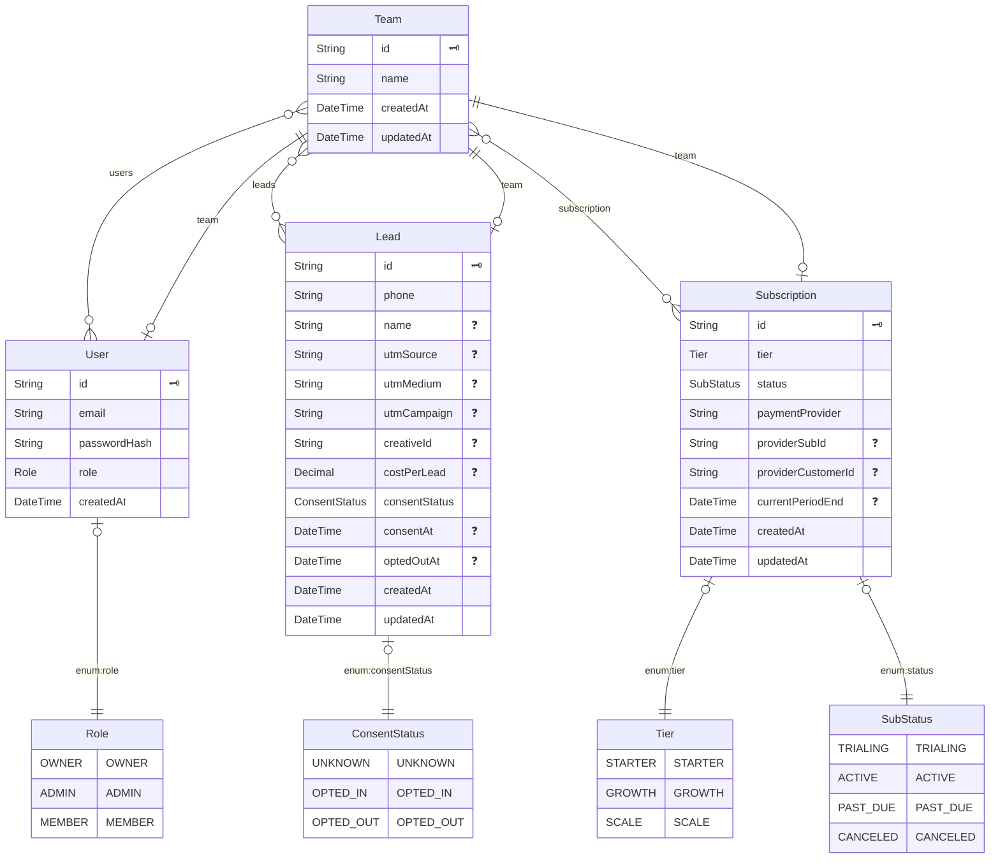

```mermaid
erDiagram

        Role {
            OWNER OWNER
ADMIN ADMIN
MEMBER MEMBER
        }
    


        ConsentStatus {
            UNKNOWN UNKNOWN
OPTED_IN OPTED_IN
OPTED_OUT OPTED_OUT
        }
    


        Tier {
            STARTER STARTER
GROWTH GROWTH
SCALE SCALE
        }
    


        SubStatus {
            TRIALING TRIALING
ACTIVE ACTIVE
PAST_DUE PAST_DUE
CANCELED CANCELED
        }
    
  "Team" {
    String id "🗝️"
    String name 
    DateTime createdAt 
    DateTime updatedAt 
    }
  

  "User" {
    String id "🗝️"
    String email 
    String passwordHash 
    Role role 
    DateTime createdAt 
    }
  

  "Lead" {
    String id "🗝️"
    String phone 
    String name "❓"
    String utmSource "❓"
    String utmMedium "❓"
    String utmCampaign "❓"
    String creativeId "❓"
    Decimal costPerLead "❓"
    ConsentStatus consentStatus 
    DateTime consentAt "❓"
    DateTime optedOutAt "❓"
    DateTime createdAt 
    DateTime updatedAt 
    }
  

  "Subscription" {
    String id "🗝️"
    Tier tier 
    SubStatus status 
    String paymentProvider 
    String providerSubId "❓"
    String providerCustomerId "❓"
    DateTime currentPeriodEnd "❓"
    DateTime createdAt 
    DateTime updatedAt 
    }
  
    "Team" o{--}o "User" : "users"
    "Team" o{--}o "Lead" : "leads"
    "Team" o{--}o "Subscription" : "subscription"
    "User" o|--|| "Role" : "enum:role"
    "User" o|--|| "Team" : "team"
    "Lead" o|--|| "Team" : "team"
    "Lead" o|--|| "ConsentStatus" : "enum:consentStatus"
    "Subscription" o|--|| "Team" : "team"
    "Subscription" o|--|| "Tier" : "enum:tier"
    "Subscription" o|--|| "SubStatus" : "enum:status"
```
