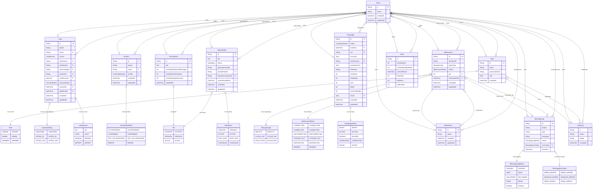

```mermaid
erDiagram

        Role {
            OWNER OWNER
ADMIN ADMIN
MEMBER MEMBER
        }


        ConsentStatus {
            UNKNOWN UNKNOWN
OPTED_IN OPTED_IN
OPTED_OUT OPTED_OUT
        }


        LeadSource {
            AD AD
CHAT CHAT
MANUAL MANUAL
IMPORT IMPORT
        }


        ContactWaStatus {
            IN_PROGRESS IN_PROGRESS
CONFIRMED CONFIRMED
NOT_ON_WHATSAPP NOT_ON_WHATSAPP
ERROR ERROR
        }


        Tier {
            STARTER STARTER
GROWTH GROWTH
SCALE SCALE
        }


        SubStatus {
            TRIALING TRIALING
ACTIVE ACTIVE
PAST_DUE PAST_DUE
CANCELED CANCELED
        }


        WaLoginType {
            BAILEYS BAILEYS
CLOUD_API CLOUD_API
EVOLUTION EVOLUTION
        }


        WaAccountStatus {
            CONNECTING CONNECTING
CONNECTED CONNECTED
DISCONNECTED DISCONNECTED
LOGGED_OUT LOGGED_OUT
RESTRICTED RESTRICTED
BANNED BANNED
        }


        CampaignStatus {
            DRAFT DRAFT
ACTIVE ACTIVE
PAUSED PAUSED
COMPLETED COMPLETED
FAILED FAILED
        }


        MessageLogStatus {
            QUEUED QUEUED
SENT SENT
DELIVERED DELIVERED
READ READ
FAILED FAILED
        }


        MessageErrorType {
            MEDIA_ERROR MEDIA_ERROR
SESSION_ERROR SESSION_ERROR
SEND_ERROR SEND_ERROR
        }

  "Team" {
    String id "🗝️"
    String name
    DateTime createdAt
    DateTime updatedAt
    }


  "User" {
    String id "🗝️"
    String email
    String passwordHash
    Role role
    DateTime createdAt
    }


  "Lead" {
    String id "🗝️"
    String phone
    String name "❓"
    LeadSource source
    String utmSource "❓"
    String utmMedium "❓"
    String utmCampaign "❓"
    String creativeId "❓"
    Decimal costPerLead "❓"
    ConsentStatus consentStatus
    DateTime consentAt "❓"
    DateTime optedOutAt "❓"
    DateTime createdAt
    DateTime updatedAt
    }


  "Contact" {
    String id "🗝️"
    String phone
    String name "❓"
    ContactWaStatus isValid "❓"
    DateTime createdAt
    DateTime updatedAt
    }


  "Subscription" {
    String id "🗝️"
    Tier tier
    SubStatus status
    String paymentProvider
    String providerSubId "❓"
    String providerCustomerId "❓"
    DateTime currentPeriodEnd "❓"
    DateTime createdAt
    DateTime updatedAt
    }


  "WaAccount" {
    String id "🗝️"
    String instanceId
    WaLoginType loginType
    WaAccountStatus status
    Int pid "❓"
    DateTime restrictedUntil "❓"
    DateTime createdAt
    DateTime updatedAt
    }


  "WaSession" {
    String id "🗝️"
    String status
    DateTime createdAt
    DateTime updatedAt
    }


  "Campaign" {
    String id "🗝️"
    CampaignStatus status
    DateTime timePost "❓"
    String run "❓"
    Json accounts
    String nextAccount "❓"
    Json scheduleTime
    String timezone
    Int minDelay
    Int maxDelay
    Int sent
    Int failed
    Int technicalFailed
    Json result "❓"
    DateTime createdAt
    DateTime updatedAt
    }


  "MessageLog" {
    String id "🗝️"
    String phone
    String type
    String message
    MessageLogStatus status
    MessageErrorType errorType "❓"
    DateTime timePost
    }


  "Stats" {
    String id "🗝️"
    Int waTotalSent
    Int waTotalSentByMonth
    DateTime waTimeReset
    Int bulkTotal
    Int bulkSent
    Int bulkFailed
    }


  "Permissions" {
    String id "🗝️"
    Tier tier
    Int monthlyBroadcastMessages
    Int monthlyAiGenerations
    Int maxWhatsappAccounts
    DateTime updatedAt
    }


  "AuditLog" {
    String id "🗝️"
    String action
    String details "❓"
    DateTime createdAt
    }

    "Team" o{--}o "User" : "users"
    "Team" o{--}o "Lead" : "leads"
    "Team" o{--}o "Subscription" : "subscription"
    "Team" o{--}o "WaAccount" : "waAccounts"
    "Team" o{--}o "Campaign" : "campaigns"
    "Team" o{--}o "Contact" : "contacts"
    "Team" o{--}o "Stats" : "stats"
    "Team" o{--}o "Permissions" : "permissions"
    "Team" o{--}o "WaSession" : "waSessions"
    "Team" o{--}o "MessageLog" : "messageLogs"
    "Team" o{--}o "AuditLog" : "auditLogs"
    "User" o|--|| "Role" : "enum:role"
    "User" o|--|| "Team" : "team"
    "User" o{--}o "AuditLog" : "auditLogs"
    "Lead" o|--|| "Team" : "team"
    "Lead" o|--|| "LeadSource" : "enum:source"
    "Lead" o|--|| "ConsentStatus" : "enum:consentStatus"
    "Contact" o|--|| "Team" : "team"
    "Contact" o|--|o "ContactWaStatus" : "enum:isValid"
    "Subscription" o|--|| "Team" : "team"
    "Subscription" o|--|| "Tier" : "enum:tier"
    "Subscription" o|--|| "SubStatus" : "enum:status"
    "WaAccount" o|--|| "Team" : "team"
    "WaAccount" o|--|| "WaLoginType" : "enum:loginType"
    "WaAccount" o|--|| "WaAccountStatus" : "enum:status"
    "WaAccount" o{--}o "WaSession" : "waSession"
    "WaAccount" o{--}o "MessageLog" : "messageLogs"
    "WaSession" o|--|| "WaAccount" : "waAccount"
    "WaSession" o|--|| "Team" : "team"
    "Campaign" o|--|| "Team" : "team"
    "Campaign" o|--|| "CampaignStatus" : "enum:status"
    "MessageLog" o|--|| "WaAccount" : "waAccount"
    "MessageLog" o|--|| "Team" : "team"
    "MessageLog" o|--|| "MessageLogStatus" : "enum:status"
    "MessageLog" o|--|o "MessageErrorType" : "enum:errorType"
    "Stats" o|--|| "Team" : "team"
    "Permissions" o|--|| "Team" : "team"
    "Permissions" o|--|| "Tier" : "enum:tier"
    "AuditLog" o|--|| "Team" : "team"
    "AuditLog" o|--|o "User" : "user"
```
